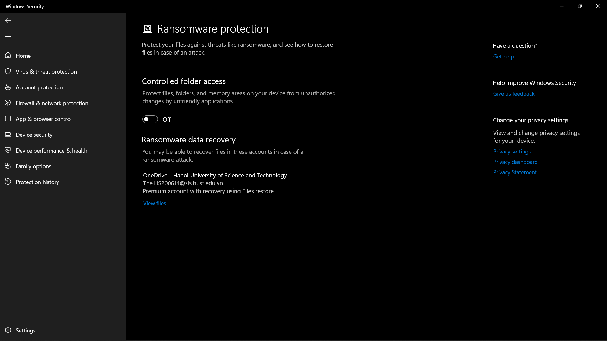

# HappyHospitalServer
OOP Exercise
- Score: 10/10 perfect.

# Cách chạy ứng dụng.
 * Note: Dùng `IntelliJ IDEA` để chạy chương trình
 * Nếu khi build Project gặp lỗi `Access denied` thì tắt `Controlled folder access` của `Windows Security`
   rồi chạy lại file `build.gradle.kts`

1. git clone Server: https://github.com/hsthe29/HappyHospitalServer.git
 và Client: https://github.com/hsthe29/OOP20212_HappyHospital.git về máy
2. Chạy file `Main` ở Server.
3. Chạy file `Main` ở Client.
4. Chờ socket kết nối và tải giao diện game.
